# Deep Research Multi-Agent System Architecture

## 🏗️ System Overview

This system implements a sophisticated multi-agent research architecture where four specialized AI agents collaborate through a coordinated workflow to perform comprehensive research tasks. Each agent directly integrates with Parallel.ai APIs and uses the Agno framework for intelligent reasoning.

## 🎯 Core Philosophy

- **Specialized Agents**: Each agent has a specific role and expertise
- **Sequential Workflow**: Agents work in a dependency-based pipeline
- **Direct API Integration**: No middleware - agents directly call Parallel.ai APIs
- **Shared Intelligence**: All agents share knowledge through a central repository
- **Fault Tolerance**: Robust error handling and workflow management

## 📊 System Architecture Overview

```mermaid
graph TB
    %% User Interface
    User[👤 User] --> AO[🎛️ Agent Orchestrator<br/>System Controller & API Gateway]
    
    %% Core Coordination Layer
    AO --> WE[🔄 Workflow Engine<br/>• Step execution<br/>• Dependency mgmt<br/>• Error handling]
    AO --> TC[📋 Task Coordinator<br/>• Queue management<br/>• Task routing<br/>• Status tracking]
    AO --> SK[🧠 Shared Knowledge<br/>• Central storage<br/>• Cross-agent comm<br/>• Search indexing]
    
    %% Agent Layer
    WE --> SA[🔍 Search Agent<br/>Information Retrieval]
    WE --> AA[📊 Analyst Agent<br/>Data Processing]
    WE --> CA[✅ Critic Agent<br/>Verification & QA]
    WE --> WA[✍️ Writer Agent<br/>Content Generation]
    
    %% API Integration Layer
    SA --> API1[⚡ Parallel.ai Task API<br/>Search & Retrieval<br/>Processors: base, pro]
    AA --> API2[⚡ Parallel.ai Task API<br/>Analysis & Processing<br/>Processors: core, ultra]
    CA --> API3[⚡ Parallel.ai Task API<br/>Verification & Validation<br/>Processors: pro, ultra]
    WA --> API4[⚡ Parallel.ai Task API<br/>Content Generation<br/>Processors: lite, base]
    
    %% Memory System
    SA --> MEM1[💾 Search Memory]
    AA --> MEM2[💾 Analysis Memory]
    CA --> MEM3[💾 Verification Memory]
    WA --> MEM4[💾 Content Memory]
    
    MEM1 --> SK
    MEM2 --> SK
    MEM3 --> SK
    MEM4 --> SK
    
    %% Output
    WA --> Report[📄 Research Report]
    Report --> User
    
    %% Styling
    classDef userClass fill:#e1f5fe,stroke:#0277bd,stroke-width:2px
    classDef orchestratorClass fill:#f3e5f5,stroke:#7b1fa2,stroke-width:2px
    classDef coordinationClass fill:#e8f5e8,stroke:#388e3c,stroke-width:2px
    classDef agentClass fill:#fff3e0,stroke:#f57c00,stroke-width:2px
    classDef apiClass fill:#fce4ec,stroke:#c2185b,stroke-width:2px
    classDef memoryClass fill:#f1f8e9,stroke:#689f38,stroke-width:2px
    classDef outputClass fill:#e3f2fd,stroke:#1976d2,stroke-width:2px
    
    class User userClass
    class AO orchestratorClass
    class WE,TC,SK coordinationClass
    class SA,AA,CA,WA agentClass
    class API1,API2,API3,API4 apiClass
    class MEM1,MEM2,MEM3,MEM4 memoryClass
    class Report outputClass
```



## 🔄 Research Workflow Pipeline

```mermaid
flowchart TD
    %% Input
    Query[📝 User Research Query<br/>Natural language input] --> Search
    
    %% Step 1: Search Agent
    Search[🔍 SEARCH AGENT<br/>Information Retrieval Specialist]
    Search --> SearchTasks[Web Research Tasks:<br/>• Information gathering<br/>• Source identification<br/>• Data extraction<br/>• Query optimization]
    SearchTasks --> SearchAPI[⚡ Parallel.ai Task API<br/>Processor: base/pro]
    SearchAPI --> SearchResults[📊 Search Results<br/>Raw data & sources]
    
    %% Step 2: Analyst Agent  
    SearchResults --> Analysis[📊 ANALYST AGENT<br/>Data Processing Specialist]
    Analysis --> AnalysisTasks[Analysis Tasks:<br/>• Pattern recognition<br/>• Statistical analysis<br/>• Insight generation<br/>• Data correlation]
    AnalysisTasks --> AnalysisAPI[⚡ Parallel.ai Task API<br/>Processor: core/ultra]
    AnalysisAPI --> AnalysisResults[🔬 Analysis Results<br/>Insights & findings]
    
    %% Step 3: Critic Agent
    AnalysisResults --> Verification[✅ CRITIC AGENT<br/>Verification & QA Specialist]
    Verification --> VerificationTasks[Verification Tasks:<br/>• Fact-checking<br/>• Source credibility<br/>• Bias detection<br/>• Quality assurance]
    VerificationTasks --> VerificationAPI[⚡ Parallel.ai Task API<br/>Processor: pro/ultra]
    VerificationAPI --> VerificationResults[✅ Verified Data<br/>Quality scores & evidence]
    
    %% Step 4: Writer Agent
    VerificationResults --> Writing[✍️ WRITER AGENT<br/>Content Generation Specialist]
    Writing --> WritingTasks[Content Tasks:<br/>• Content synthesis<br/>• Report structuring<br/>• Citation management<br/>• Format optimization]
    WritingTasks --> WritingAPI[⚡ Parallel.ai Task API<br/>Processor: lite/base]
    WritingAPI --> FinalReport[📄 RESEARCH REPORT<br/>Comprehensive deliverable]
    
    %% Memory Storage (parallel to main flow)
    SearchResults --> SearchMem[💾 Search Memory]
    AnalysisResults --> AnalysisMem[💾 Analysis Memory]
    VerificationResults --> VerificationMem[💾 Verification Memory]
    FinalReport --> ContentMem[💾 Content Memory]
    
    SearchMem --> SharedKnowledge[🧠 Shared Knowledge Repository]
    AnalysisMem --> SharedKnowledge
    VerificationMem --> SharedKnowledge
    ContentMem --> SharedKnowledge
    
    %% Final Output
    FinalReport --> UserOutput[👤 User Receives<br/>Complete Research Report]
    
    %% Styling
    classDef inputClass fill:#e3f2fd,stroke:#1976d2,stroke-width:2px
    classDef agentClass fill:#fff3e0,stroke:#f57c00,stroke-width:3px
    classDef taskClass fill:#f3e5f5,stroke:#7b1fa2,stroke-width:2px
    classDef apiClass fill:#fce4ec,stroke:#c2185b,stroke-width:2px
    classDef resultClass fill:#e8f5e8,stroke:#388e3c,stroke-width:2px
    classDef memoryClass fill:#f1f8e9,stroke:#689f38,stroke-width:2px
    classDef outputClass fill:#e1f5fe,stroke:#0277bd,stroke-width:3px
    
    class Query,UserOutput inputClass
    class Search,Analysis,Verification,Writing agentClass
    class SearchTasks,AnalysisTasks,VerificationTasks,WritingTasks taskClass
    class SearchAPI,AnalysisAPI,VerificationAPI,WritingAPI apiClass
    class SearchResults,AnalysisResults,VerificationResults,FinalReport resultClass
    class SearchMem,AnalysisMem,VerificationMem,ContentMem,SharedKnowledge memoryClass
    class FinalReport outputClass
```



## 🤖 Agent Detailed Specifications

### 🔍 Search Agent - Information Retrieval Specialist
**Role**: First-stage data collection and web research
- **Framework**: Agno Agent + AsyncParallel client
- **API Method**: `client.task_run.execute()`
- **Processors**: `base` (fast), `pro` (comprehensive)
- **Capabilities**:
  - Web search and information gathering
  - Source identification and ranking
  - Data extraction and preprocessing
  - Query optimization and refinement
- **Input**: Natural language research query
- **Output**: Structured search results with sources
- **Memory**: Stores search history, results, and API responses

### 📊 Analyst Agent - Data Processing Specialist  
**Role**: Transform raw data into meaningful insights
- **Framework**: Agno Agent + AsyncParallel client
- **API Method**: `client.task_run.execute()`
- **Processors**: `core` (standard), `ultra` (complex analysis)
- **Capabilities**:
  - Statistical analysis and pattern recognition
  - Data correlation and trend identification
  - Insight generation and hypothesis formation
  - Structured data transformation
- **Input**: Raw search results from Search Agent
- **Output**: Processed insights, findings, and analysis
- **Memory**: Stores analytical results, insights, and processed data

### ✅ Critic Agent - Verification & Quality Assurance Specialist
**Role**: Fact-checking, validation, and quality control
- **Framework**: Agno Agent + AsyncParallel client  
- **API Method**: `client.task_run.execute()`
- **Processors**: `pro` (fact-checking), `ultra` (complex validation)
- **Capabilities**:
  - Fact-checking and source verification
  - Bias detection and credibility assessment
  - Cross-referencing and validation
  - Quality scoring and confidence metrics
- **Input**: Analysis results from Analyst Agent
- **Output**: Verified data with confidence scores and evidence
- **Memory**: Stores verification results, fact-checks, and validation data

### ✍️ Writer Agent - Content Generation Specialist
**Role**: Synthesize verified data into comprehensive reports
- **Framework**: Agno Agent + AsyncParallel client
- **API Method**: `client.task_run.execute()`  
- **Processors**: `lite` (fast generation), `base` (quality content)
- **Capabilities**:
  - Content synthesis and report generation
  - Template-based formatting and structuring
  - Citation management and source attribution
  - Multi-format output (markdown, HTML, plain text)
- **Input**: Verified data from Critic Agent
- **Output**: Comprehensive research reports with proper citations
- **Memory**: Stores generated content, templates, and formatting data

## 🧠 Memory & Knowledge Management System

### Specialized Memory Components
Each agent has dedicated memory storage optimized for its specific data types:

#### 🔍 Search Memory
- **Purpose**: Stores web research data and search metadata
- **Contents**: 
  - Search queries and results
  - API response data and timestamps
  - Source URLs and credibility scores
  - Search history and query optimization data
- **Access Pattern**: Read-heavy for cross-referencing and duplicate detection

#### 📊 Analysis Memory  
- **Purpose**: Stores processed insights and analytical results
- **Contents**:
  - Statistical analysis results and confidence scores
  - Pattern recognition data and trend analysis
  - Insights, hypotheses, and structured findings
  - Data correlation matrices and relationships
- **Access Pattern**: Write-heavy during analysis, read-heavy for verification

#### ✅ Verification Memory
- **Purpose**: Stores fact-checking and validation results  
- **Contents**:
  - Fact-check results with evidence and sources
  - Credibility assessments and bias detection
  - Cross-reference validation data
  - Quality scores and confidence metrics
- **Access Pattern**: Sequential write during verification, random read for reporting

#### ✍️ Content Memory
- **Purpose**: Stores generated content and formatting templates
- **Contents**:
  - Generated reports and content templates
  - Formatting rules and style guidelines  
  - Citation databases and source attributions
  - Multi-format output versions (MD, HTML, PDF)
- **Access Pattern**: Template-based read, versioned write for content generation

#### 🌐 Shared Knowledge Repository
- **Purpose**: Central hub for cross-agent communication and knowledge sharing
- **Contents**:
  - Unified knowledge graph with relationships
  - Cross-agent data dependencies and references
  - System-wide search index and metadata
  - Historical workflow results and performance metrics
- **Access Pattern**: High-frequency read/write from all agents

### Memory System Architecture

```mermaid
graph TB
    %% Agents
    SA[🔍 Search Agent] --> SM[💾 Search Memory<br/>• Queries & Results<br/>• Source URLs<br/>• API Responses<br/>• Search History]
    AA[📊 Analyst Agent] --> AM[💾 Analysis Memory<br/>• Statistical Results<br/>• Pattern Data<br/>• Insights & Findings<br/>• Correlations]
    CA[✅ Critic Agent] --> VM[💾 Verification Memory<br/>• Fact-check Results<br/>• Credibility Scores<br/>• Validation Data<br/>• Quality Metrics]
    WA[✍️ Writer Agent] --> CM[💾 Content Memory<br/>• Generated Reports<br/>• Templates<br/>• Style Guidelines<br/>• Citations]
    
    %% Shared Knowledge Hub
    SM --> SKR[🧠 Shared Knowledge Repository<br/>• Unified Knowledge Graph<br/>• Cross-agent Dependencies<br/>• Search Index<br/>• Performance Metrics]
    AM --> SKR
    VM --> SKR
    CM --> SKR
    
    %% Cross-agent Access
    SKR -.-> SA
    SKR -.-> AA
    SKR -.-> CA
    SKR -.-> WA
    
    %% External Storage
    SKR --> DB[(🗄️ Database<br/>SQLite/PostgreSQL)]
    SKR --> CACHE[(⚡ Redis Cache<br/>Fast Access)]
    
    %% Styling
    classDef agentClass fill:#fff3e0,stroke:#f57c00,stroke-width:2px
    classDef memoryClass fill:#f1f8e9,stroke:#689f38,stroke-width:2px
    classDef sharedClass fill:#f3e5f5,stroke:#7b1fa2,stroke-width:3px
    classDef storageClass fill:#e3f2fd,stroke:#1976d2,stroke-width:2px
    
    class SA,AA,CA,WA agentClass
    class SM,AM,VM,CM memoryClass
    class SKR sharedClass
    class DB,CACHE storageClass
```



## ⚙️ System Coordination Components

### 🎛️ Agent Orchestrator
**Primary Responsibilities**:
- **Lifecycle Management**: Start/stop agents, health monitoring
- **API Gateway**: Handle external requests, route to appropriate workflows  
- **Background Processing**: Manage async task queues and long-running operations
- **System Status**: Provide real-time status and performance metrics
- **Knowledge Coordination**: Facilitate cross-agent data sharing

### 🔄 Workflow Engine
**Primary Responsibilities**:
- **Dependency Management**: Ensure proper agent execution order
- **Step Execution**: Parallel task execution where possible
- **Error Handling**: Retry logic, fallback strategies, graceful degradation
- **Progress Tracking**: Real-time workflow status and completion metrics
- **Result Aggregation**: Combine multi-agent outputs into cohesive results

### 📋 Task Coordinator  
**Primary Responsibilities**:
- **Queue Management**: Priority-based task scheduling and load balancing
- **Task Routing**: Direct tasks to appropriate agents based on type and load
- **Status Tracking**: Monitor task progress, completion, and failure states
- **History Management**: Maintain audit trail of all task executions
- **Resource Allocation**: Manage API rate limits and computational resources

## 🔄 Data Flow & Communication Patterns

### Sequential Pipeline (Primary Pattern)


### Cross-Agent Communication
- **Direct Memory Access**: Agents read from predecessor's memory
- **Shared Knowledge Updates**: Real-time updates to central repository  
- **Dependency Resolution**: Automatic data flow based on workflow dependencies
- **Error Propagation**: Failure states communicated upstream for retry logic

## 🚀 Key Architectural Benefits

### Performance & Scalability
- **Direct API Integration**: Zero-latency agent-to-API communication
- **Parallel Execution**: Independent agents can run simultaneously when dependencies allow
- **Memory Optimization**: Specialized storage reduces data duplication and improves access speed
- **Async Processing**: Non-blocking operations for better resource utilization

### Reliability & Fault Tolerance
- **Dependency Isolation**: Agent failures don't cascade through the system
- **Retry Mechanisms**: Automatic retry with exponential backoff for API failures
- **Graceful Degradation**: System continues operating with reduced functionality
- **Comprehensive Logging**: Full audit trail for debugging and monitoring

### Maintainability & Extensibility  
- **Modular Design**: Add/remove agents without affecting core system
- **Clear Separation**: Each component has well-defined responsibilities
- **API Abstraction**: Changes to external APIs isolated to individual agents
- **Configuration-Driven**: Processor selection and workflow customization via config

### Intelligence & Quality
- **Specialized Processing**: Each agent optimized for its specific task domain
- **Quality Assurance**: Multi-stage verification ensures high-quality outputs
- **Knowledge Accumulation**: System learns and improves from historical data
- **Contextual Awareness**: Agents have access to full workflow context for better decisions

## 🔧 Technical Implementation Details

### API Integration Layer
```python
# All agents use the corrected Parallel.ai API pattern:
from parallel import AsyncParallel

client = AsyncParallel(api_key=settings.parallel_api_key)
result = await client.task_run.execute(
    input="Research query or analysis prompt",
    processor="base|lite|core|pro|ultra|ultra2x|ultra4x|ultra8x",
    output="Expected output description"
)
```

### Supported Processors
- **lite**: Fastest, basic processing
- **base**: Standard processing, good balance
- **core**: Enhanced processing with better accuracy  
- **pro**: Professional-grade processing for complex tasks
- **ultra**: Maximum processing power for complex analysis
- **ultra2x/4x/8x**: Scaled ultra processing for intensive workloads

### Workflow Configuration
```python
processor_config = {
    "search": "base",      # Fast web search
    "analysis": "core",    # Standard analysis
    "verification": "pro", # High-quality fact-checking
    "content": "lite"      # Fast content generation
}
```

### Error Handling Strategy
1. **API Failures**: Automatic retry with exponential backoff
2. **Agent Failures**: Graceful degradation with partial results
3. **Dependency Failures**: Skip dependent steps, continue with available data
4. **Timeout Handling**: Configurable timeouts per agent and overall workflow

## 📊 Performance Characteristics

### Typical Response Times
- **Search Agent**: 2-5 seconds (depends on processor)
- **Analyst Agent**: 3-8 seconds (depends on data complexity)
- **Critic Agent**: 4-10 seconds (depends on verification depth)
- **Writer Agent**: 2-6 seconds (depends on content length)
- **Total Pipeline**: 15-45 seconds for comprehensive research

### Resource Requirements
- **Memory**: ~100MB base + ~10MB per concurrent workflow
- **CPU**: Minimal (I/O bound operations)
- **Network**: High bandwidth recommended for API calls
- **Storage**: Configurable (SQLite default, PostgreSQL recommended for production)

## 🛡️ Security & Privacy

### API Security
- **Authentication**: Secure API key management via environment variables
- **Rate Limiting**: Built-in respect for Parallel.ai rate limits
- **Request Validation**: Input sanitization and validation
- **Error Masking**: Sensitive information filtered from error responses

### Data Privacy
- **Memory Isolation**: Agent memories are logically separated
- **Data Retention**: Configurable retention policies for research data
- **Access Control**: Agent-level access controls for sensitive operations
- **Audit Logging**: Comprehensive logging for compliance and debugging

## 🚀 Deployment & Operations

### Development Setup
```bash
# Clone and setup
git clone <repository>
cd deep-research
pip install -r requirements.txt

# Configure environment
cp .env.example .env
# Edit .env with your API keys

# Run development server
python run.py
```

### Production Deployment

```mermaid
graph TB
    %% External Layer
    Users[👥 Users] --> LB[⚖️ Load Balancer<br/>NGINX/HAProxy]
    
    %% Application Layer
    LB --> APP1[🚀 Deep Research Instance 1<br/>FastAPI + Uvicorn<br/>Port 8000]
    LB --> APP2[🚀 Deep Research Instance 2<br/>FastAPI + Uvicorn<br/>Port 8001]
    LB --> APP3[🚀 Deep Research Instance N<br/>FastAPI + Uvicorn<br/>Port 800N]
    
    %% Agent Layer (within each instance)
    APP1 --> AGENTS1[🤖 Multi-Agent System<br/>Search • Analyst • Critic • Writer]
    APP2 --> AGENTS2[🤖 Multi-Agent System<br/>Search • Analyst • Critic • Writer]
    APP3 --> AGENTS3[🤖 Multi-Agent System<br/>Search • Analyst • Critic • Writer]
    
    %% External APIs
    AGENTS1 --> PAPI[⚡ Parallel.ai APIs<br/>Task Execution]
    AGENTS2 --> PAPI
    AGENTS3 --> PAPI
    
    AGENTS1 --> OAPI[🤖 OpenAI API<br/>Agno Framework]
    AGENTS2 --> OAPI
    AGENTS3 --> OAPI
    
    %% Data Layer
    APP1 --> REDIS[(⚡ Redis Cluster<br/>Caching & Sessions)]
    APP2 --> REDIS
    APP3 --> REDIS
    
    APP1 --> DB[(🗄️ PostgreSQL<br/>Primary Database)]
    APP2 --> DB
    APP3 --> DB
    
    %% Monitoring & Logging
    APP1 --> MON[📊 Monitoring<br/>Prometheus + Grafana]
    APP2 --> MON
    APP3 --> MON
    
    APP1 --> LOGS[📝 Centralized Logging<br/>ELK Stack]
    APP2 --> LOGS
    APP3 --> LOGS
    
    %% Styling
    classDef userClass fill:#e3f2fd,stroke:#1976d2,stroke-width:2px
    classDef infraClass fill:#f1f8e9,stroke:#689f38,stroke-width:2px
    classDef appClass fill:#fff3e0,stroke:#f57c00,stroke-width:2px
    classDef agentClass fill:#f3e5f5,stroke:#7b1fa2,stroke-width:2px
    classDef apiClass fill:#fce4ec,stroke:#c2185b,stroke-width:2px
    classDef dataClass fill:#e8f5e8,stroke:#388e3c,stroke-width:2px
    classDef monitorClass fill:#e1f5fe,stroke:#0277bd,stroke-width:2px
    
    class Users userClass
    class LB infraClass
    class APP1,APP2,APP3 appClass
    class AGENTS1,AGENTS2,AGENTS3 agentClass
    class PAPI,OAPI apiClass
    class REDIS,DB dataClass
    class MON,LOGS monitorClass
```



**Components:**
- **Web Server**: FastAPI with Uvicorn (async ASGI)
- **Database**: PostgreSQL recommended for production
- **Caching**: Redis for session and result caching
- **Monitoring**: Built-in health checks and metrics endpoints
- **Scaling**: Horizontal scaling via load balancer + multiple instances

### API Endpoints
- `POST /research` - Synchronous research pipeline
- `POST /research/async` - Asynchronous research with task ID
- `GET /task/{task_id}` - Check async task status
- `GET /status` - System health and status
- `GET /agents` - Agent status and performance metrics
- `GET /knowledge/search` - Search system knowledge
- `GET /docs` - Interactive API documentation

## 🔮 Future Enhancements

### Planned Features
- **Multi-Language Support**: Research in multiple languages
- **Custom Agent Types**: User-defined specialized agents
- **Advanced Analytics**: Machine learning insights on research patterns
- **Real-Time Collaboration**: Multi-user research sessions
- **Export Formats**: PDF, DOCX, and presentation formats

### Scalability Improvements
- **Distributed Processing**: Multi-node agent execution
- **Advanced Caching**: Intelligent result caching and reuse
- **Stream Processing**: Real-time result streaming
- **API Optimization**: Request batching and connection pooling

This architecture provides a robust, scalable, and intelligent foundation for automated research tasks while maintaining flexibility for future enhancements and customizations.
